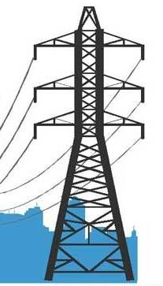

<p align="center">
  
</p>

<h1 align="center">⚡ Electricity Theft Detection System</h1>

<p align="center">
  <b>Explainable Machine Learning + Interactive Analytics for Smart Meter Fraud Detection</b>
</p>

<p align="center">
  <a href="#-key-features">Features</a> •
  <a href="#-architecture">Architecture</a> •
  <a href="#-quick-start">Quick Start</a> •
  <a href="#-model--results">Model & Results</a> •
  <a href="#-team">Team</a>
</p>

---

## 🏆 About This Project

An AI-powered web application that analyses smart-meter consumption data and flags customers with a high
probability of **electricity theft** (meter bypass, tampering, hooking, or abnormal load patterns).

Instead of returning a bare yes/no answer, the system produces an **explainable verdict**: theft probability,
risk level, confidence score, the *reason* behind the detection, a recommended field action, feature-importance
analysis, interactive charts, printable inspection reports and automated warning/alert emails.

> 🥇 **Achievement:** This university project was selected for an **International Conference**, where it competed in the
> exhibition and won **1st Position**.

---

## ✨ Key Features

| Category | What it does |
| :--- | :--- |
| 🔍 **Dual Prediction Modes** | Single-customer manual entry form, or bulk CSV upload (thousands of records at once) |
| 🧠 **Explainable ML** | Per-customer feature importance + plain-language theft reason (`Theft_Description`) |
| 📊 **Risk Engine** | Probability → `Low / Medium / High` risk, confidence score and a 0–100 risk score |
| 📈 **Analytics Dashboard** | Risk pie, probability histogram, top-20 risk timeline, 3D feature-space plot, model comparison |
| 🎯 **Actionable Output** | Every record gets a `Next_Action` (immediate inspection, remote audit, or monitor) |
| 📄 **Reports** | One-click generated electricity-theft inspection report (Markdown) |
| 📧 **Email Automation** | Warning emails to customers + alert emails to the inspection team via SMTP |
| 💾 **Multi-format Export** | Download results as **CSV**, **Excel** (with summary sheet) or **JSON** |
| 🔎 **Search & Filter** | Filter by risk level / probability, search by customer ID, sort by any column |
| 🎨 **Branded UI** | Custom Streamlit theme, logo, background and animated risk indicators |

---

## 🏗️ Architecture

```
AI_FINAL_PROJECT/
│
├── app4.py              # Main Streamlit entry point (app orchestration)
├── config.py            # Thresholds, branding, image encoding, custom CSS
├── model_utils.py       # Model loading, prediction, feature importance
├── ui_components.py     # Page setup, sidebar, manual/batch UI, email flow
├── visualizations.py    # Plotly charts (risk, probability, timeline, 3D, gauges)
├── reports.py           # Inspection report generation
├── email_utils.py       # SMTP sending + customer/alert email templates
│
├── model_theft.pkl      # Trained XGBoost classifier (joblib)
├── requirements.txt
│
└── data/
    ├── FINAL_MODEL_TRAIN_2.ipynb        # Training: SMOTE → grid search → early stopping → threshold tuning
    ├── make_final_dataset_for_model.ipynb
    ├── original data/                    # Raw + engineered SGCC features
    ├── lums data/                        # Household smart-meter readings (House1–House6)
    └── test data/                        # Sample CSVs for quick testing
```

**Design principle:** every module has a single responsibility — `model_utils` never touches UI, `visualizations`
never touches the model — so features can be added, tested and reused independently.

---

## 🎨 Design System — High-Fidelity Claymorphism

The whole UI is built on a **"Digital Clay"** design system: soft-touch matte surfaces, 4-layer shadow
stacks, super-rounded corners and bouncy micro-interactions.

| Token | Value |
| :--- | :--- |
| Canvas | `#F4F1FA` (pale lavender-white) |
| Text | `#332F3A` primary · `#635F69` muted |
| Primary accent | `#7C3AED` vivid violet |
| Secondary accents | `#DB2777` pink · `#0EA5E9` sky · `#10B981` emerald · `#F59E0B` amber |
| Typography | **Nunito** 700–900 (headings/numbers) + **DM Sans** (body) |
| Radii | `20px` buttons · `24–32px` cards · `48px` containers — never sharp corners |
| Shadows | `clay-card`, `clay-btn`, `clay-pressed`, `clay-card-lift` (multi-layer) |
| Motion | `clay-float` 8s · `clay-float-delayed` 10s · `clay-breathe` 6s + `prefers-reduced-motion` |

Implementation lives in `config.py` (`CLAY` tokens + `get_custom_css()`), with reusable HTML builders
(`clay_section_title`, `clay_metric`, `clay_chip`, `clay_info_card`, `get_clay_blobs`) and the matching
theme in `.streamlit/config.toml`. Every chart uses the shared `clay_layout()` palette from `visualizations.py`.

---

## ⚡ Quick Start

### 1. Clone the repository

```bash
git clone https://github.com/AZANAMIR272/electricity-theft-detection.git
cd electricity-theft-detection
```

### 2. Create an environment & install dependencies

```bash
python -m venv .venv
.venv\Scripts\activate        # Windows
# source .venv/bin/activate   # macOS / Linux

pip install -r requirements.txt
```

### 3. Run the application

```bash
streamlit run app4.py
```

The dashboard opens at **http://localhost:8501**.

### 4. Try it

* **Manual mode** → fill the customer form → *Predict Theft Risk*
* **Batch mode** → upload `data/test data/test_data.csv` → *Generate Batch Predictions*

---

## 🚀 Deploy (Live — Streamlit Community Cloud)

Everything the platform needs is already in the repo: `requirements.txt` (root), `app4.py` (entrypoint),
`.streamlit/config.toml` (theme) and a tracked `model_theft.pkl`.

1. Go to **[share.streamlit.io](https://share.streamlit.io)** → *Continue with GitHub* (use the `AZANAMIR272` account).
2. **Create app** → *Yup, I have an app*.
3. Fill in:

   | Field | Value |
   | :--- | :--- |
   | Repository | `AZANAMIR272/electricity-theft-detection` |
   | Branch | `main` |
   | File path | `app4.py` |
   | App URL | e.g. `electricity-theft-detection` |

4. **Advanced settings** → Python version **3.11** (or 3.12) → paste the contents of
   `.streamlit/secrets.toml.example` into **Secrets** (with your real SMTP values, or leave it empty to
   use the sidebar form).
5. **Deploy** → build takes a few minutes → live at `https://<your-app>.streamlit.app`.
6. Any later `git push` to `main` redeploys automatically.

> Deploys **sleep after ~12 h of no traffic** (free tier) — a single visit wakes it up again.
> Live SMTP needs Gmail's *app-specific password*, which only you can generate.

---

## 🧬 How Detection Works

1. **Feature Engineering** — raw smart-meter readings are converted into 9 behavioural features:

   | Feature | Intuition |
   | :--- | :--- |
   | `missing_day_count` | Gaps in meter reporting (possible tampering) |
   | `avg_consumption` | Average daily load |
   | `std_consumption` | Load variability — unnaturally flat load is suspicious |
   | `min_consumption` / `max_consumption` | Load range |
   | `total_consumption` | Overall billed energy |
   | `zero_consumption_days` | Long zero-read stretches → meter bypass |
   | `max_to_mean_ratio` | Extreme spikes → load manipulation |

2. **Class Imbalance Handling** — theft cases are rare, so **SMOTE** oversampling is applied on the training split.
3. **Model** — **XGBoost** classifier with stratified split, hyper-parameter grid search + cross-validation,
   early stopping and **threshold optimisation** (operating threshold `0.40`, tuned for higher recall).
4. **Interpretation** — each prediction is perturbed feature-by-feature to measure each feature's contribution,
   then converted into a human-readable reason and a recommended action.

---

## 📈 Model & Results

| Model | Accuracy |
| :--- | :---: |
| **XGBoost (ours)** | **80.02 %** |
| Decision Tree | 75.76 % |
| Linear Regression | 73.70 % |
| KNN | 71.27 % |

* Dataset: engineered smart-meter consumption features (SGCC-style public electricity-theft dataset +
  household smart-meter data), heavily class-imbalanced.
* Evaluation emphasises **recall** — missing a real theft case is costlier than a false alarm.
* Trained model ships with the app as `model_theft.pkl`, so no re-training is required to run the system.

---

## 📬 Email Notifications (Optional)

SMTP credentials are read **in this order**:

1. **Streamlit Secrets** — `.streamlit/secrets.toml` locally, or the *Secrets* field on a cloud deployment
   (copy `.streamlit/secrets.toml.example` and fill it in; `secrets.toml` is git-ignored so keys never reach the repo)
2. **Sidebar form** — used only when no secrets file exists (local development)

| Field | Example |
| :--- | :--- |
| `smtp_server` | `smtp.gmail.com` |
| `smtp_port` | `587` |
| `sender_email` | your address |
| `sender_password` | Gmail app-specific password |

Once configured, batch runs automatically send warning emails to high-risk customers and alert emails to the inspection team.

---

## 📂 Sample Data

| File | Purpose |
| :--- | :--- |
| `data/test data/test_data.csv` | Minimal batch file to smoke-test the app |
| `data/lums data/new_consumers_test.csv` | Header-style sample with friendly column names |
| `data/lums data/theft_prediction_insights_batch.csv` | Example of generated output |

> **CSV contract:** index/column `CONS_NO` first, followed by the 9 features in the order listed above.

---

## 🛠️ Tech Stack

`Python 3.10+` · `Streamlit` · `XGBoost` · `scikit-learn` · `imbalanced-learn (SMOTE)` ·
`pandas` · `numpy` · `Plotly` · `joblib` · `smtplib`

---

## 👥 Team

| Role | Member |
| :--- | :--- |
| 👑 **Team Leader** | **Syed Muhammad Azan** |
| Member | Isbah Ali |
| Member | Muhammad Safwan |
| Member | Shaheer Abbasi |

---

## 📜 License

Released for academic and demonstration purposes. Please credit the authors if you build upon this work.

---

<p align="center">Made with ❤️ for the smart-grid of tomorrow ⚡</p>
